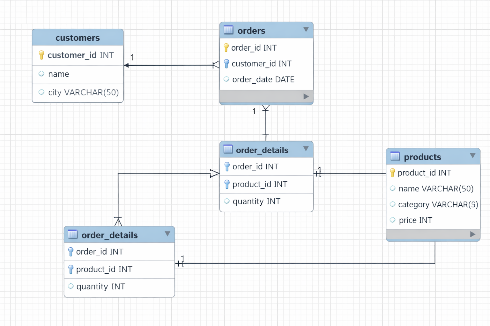

# 🛒 E-Commerce SQL Project

## 📌 Overview
This project analyzes e-commerce data using SQL.

## 🧰 Tools Used
- MySQL
- SQL

## 📊 Features
- Total revenue analysis
- Top-selling products
- Customer insights
- Monthly sales trends

## 🧩 ER Diagram

## 🚀 SQL Concepts
- Joins
- GROUP BY
- Aggregations
- Window Functions

## 📈 Outcome
Generated business insights from raw data.
